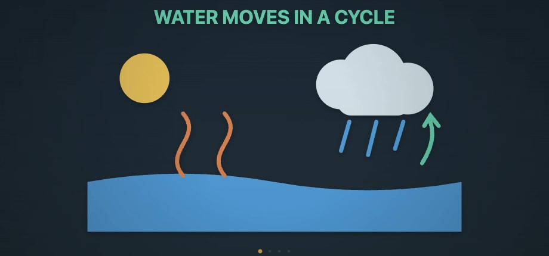

# Lumen

Lumen turns a small, validated Simple JSON lesson into a deterministic,
seekable educational video rendered live on an HTML canvas. It does not call
an LLM at runtime. Codex or Claude can author the lesson data, while Lumen
validates, compiles, renders, narrates, and optionally exports it.

> **Release status:** `0.1.0-beta.1` is prepared locally but has not been
> published to npm yet.

## Demo

[](docs/assets/lumen-water-cycle-demo.mp4)

**[Watch or download the 22-second Water Cycle MP4](docs/assets/lumen-water-cycle-demo.mp4).**

This silent demo was authored as Simple JSON, validated by Lumen, rendered on
HTML Canvas, and exported in the browser as a deterministic H.264 MP4. Optional
narration can be added with the separate Cartesia adapter using your own key.

## Packages

| Package | Purpose |
|---|---|
| `@aira/lumen` | Simple JSON schema, validation, compiler, canvas renderer, capabilities, and Codex/Claude prompts |
| `@aira/lumen-react` | React canvas player with play, pause, seek, captions, and synchronized audio |
| `@aira/lumen-cartesia` | Optional Cartesia narration, timestamps, local audio cache, and scene alignment |
| `@aira/lumen-mp4` | Optional browser MP4 exporter using WebCodecs |

The core package has no React, Cartesia, MP4, or LLM SDK dependency.
All packages are ESM-only. Repository tooling requires Node.js 20 or newer.

## Five-minute installation

Core only:

```bash
npm install @aira/lumen
```

React player:

```bash
npm install @aira/lumen @aira/lumen-react react react-dom
```

Optional narration and export:

```bash
npm install @aira/lumen-cartesia @aira/lumen-mp4
```

For local repository development:

```bash
npm install
npm run dev
```

The playground asks for **your own Cartesia key**. No AiRA provider key is
included in the repository or packages.

## Minimal Simple JSON lesson

```ts
import type { LessonSpec } from "@aira/lumen";

export const lesson: LessonSpec = {
  version: "1",
  title: "Why Objects Fall",
  theme: "textbook",
  scenes: [
    {
      id: "fall",
      composition: "hero-diagram",
      narration:
        "Watch the apple. Gravity continually changes its downward speed.",
      objects: [
        {
          id: "title",
          kind: "text",
          text: "GRAVITY CHANGES VELOCITY",
          textRole: "heading",
          placement: { mode: "zone", zone: "title" }
        },
        {
          id: "apple",
          kind: "visual",
          asset: "physics.apple",
          placement: { mode: "zone", zone: "main" }
        },
        {
          id: "ground",
          kind: "line",
          from: [300, 350],
          to: [620, 350],
          form: "plain"
        }
      ],
      beats: [
        {
          id: "reveal",
          pace: "slow",
          actions: [
            { "do": "show", "targets": ["title", "apple", "ground"], "entrance": "fade" }
          ]
        },
        {
          id: "fall",
          pace: "dramatic",
          actions: [
            { "do": "motion", "target": "apple", "motion": "fall", "to": "ground" }
          ]
        }
      ]
    }
  ]
};
```

## Vanilla canvas usage

```ts
import {
  drawSlideFrame,
  renderLessonSpec,
  TEXTBOOK
} from "@aira/lumen";
import { lesson } from "./lesson";

const result = renderLessonSpec(lesson);
if (!result.valid) {
  console.error(result.errors);
  throw new Error("Lesson is invalid");
}

const canvas = document.querySelector("canvas")!;
const context = canvas.getContext("2d")!;
const { slide } = result;

canvas.width = slide.viewW;
canvas.height = slide.viewH;

const started = performance.now();
function frame(now: number) {
  const seconds = Math.min((now - started) / 1000, slide.duration);
  context.clearRect(0, 0, slide.viewW, slide.viewH);
  drawSlideFrame(context, slide, seconds, TEXTBOOK);
  if (seconds < slide.duration) requestAnimationFrame(frame);
}
requestAnimationFrame(frame);
```

## React usage

```tsx
import { renderLessonSpec } from "@aira/lumen";
import { CanvasSlide } from "@aira/lumen-react";
import "@aira/lumen-react/style.css";
import { lesson } from "./lesson";

const result = renderLessonSpec(lesson);

export function LessonVideo() {
  if (!result.valid) {
    return <pre>{JSON.stringify(result.errors, null, 2)}</pre>;
  }

  return (
    <CanvasSlide
      slide={result.slide}
      title={lesson.title}
      tag="A deterministic Simple JSON lesson"
    />
  );
}
```

## Validation and diagnostics

Always validate generated lesson data before rendering:

```ts
import { compileLessonSpec } from "@aira/lumen";

const result = compileLessonSpec(untrustedJson);

if (!result.valid) {
  for (const diagnostic of result.errors) {
    console.error(diagnostic.code, diagnostic.path, diagnostic.message);
  }
} else if (result.warnings.length) {
  console.warn(result.warnings);
}
```

Validation covers conditional chart and motion fields, references, anchors,
expressions, SVG safety, lifecycle, map data, timeline data, layout, motion
continuity, and deterministic keyframes.

## Narration integration

Cartesia is optional. The adapter requires a caller-supplied key:

```ts
import {
  fullNarration,
  sceneFloors,
  synthesizeNarration
} from "@aira/lumen-cartesia";

const narration = await synthesizeNarration(fullNarration(lesson), {
  apiKey: userSuppliedKey,
  voice: "female"
});

const result = renderLessonSpec(lesson, {
  sceneFloors: sceneFloors(lesson, narration.words),
  audioUrl: narration.audioUrl
});
```

The playground stores the entered key only in `sessionStorage`. For a public
production application, proxy Cartesia through your own backend or issue
short-lived credentials. Do not ship a permanent provider key in browser code.

See [Cartesia integration](docs/CARTESIA.md).

## Create a video with Codex or Claude

Lumen includes agent-specific instructions and copyable prompts:

- [Create a video with Codex](docs/CREATE_VIDEO_WITH_CODEX.md)
- [Create a video with Claude](docs/CREATE_VIDEO_WITH_CLAUDE.md)
- [End-to-end video workflow](docs/CREATE_VIDEO.md)
- [Codex prompt](prompts/codex-create-video.md)
- [Claude prompt](prompts/claude-create-video.md)

Both workflows author Simple JSON locally and run Lumen validation. They do not
require an OpenAI or Anthropic API integration inside the library.

## Browser compatibility

- Rendering: modern browsers with Canvas 2D, `Path2D`, `ResizeObserver`, and ES2022 support.
- React player: current evergreen browsers.
- Cartesia adapter: browsers that support WebSockets, Blob URLs, and IndexedDB.
- MP4 export: browsers with WebCodecs; recent Chromium is the recommended target.

The compiler and validators can run without React. Frame rendering requires a
browser-compatible canvas environment. See the
[browser support policy](docs/BROWSER_SUPPORT.md).

## Security

- Treat lesson JSON and SVG as untrusted input and always compile it first.
- Lumen rejects scripts, event handlers, external SVG references, unsupported
  markup, invalid expressions, and unknown fields.
- Do not expose permanent Cartesia or other provider keys in frontend bundles.
- Lower-level GCL image URLs can initiate browser requests; only accept trusted
  URLs if you expose that advanced API.
- Report vulnerabilities according to [SECURITY.md](SECURITY.md).

## Documentation and examples

- [Getting started](docs/GETTING_STARTED.md)
- [Public API](docs/API.md)
- [Architecture](docs/ARCHITECTURE.md)
- [Public API stability](docs/PUBLIC_API_STABILITY.md)
- [Browser support](docs/BROWSER_SUPPORT.md)
- [Release process](docs/RELEASING.md)
- [Release readiness](docs/RELEASE_READINESS.md)
- [Simple JSON LLM context](docs/SIMPLE-JSON-LLM-CONTEXT.md)
- [Agent authoring skills](docs/skills/README.md)
- [Vanilla example](examples/vanilla)
- [React example](examples/react)
- [Playground](apps/playground)

## Development

```bash
npm install
npm run build
npm run typecheck
npm run pack:audit
```

Lumen is licensed under the Apache License 2.0. See [LICENSE](LICENSE).
